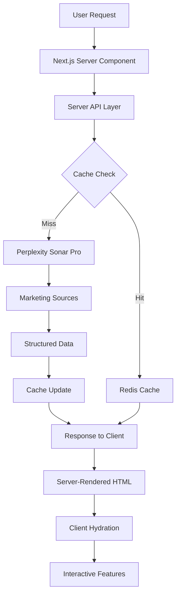

# 🧠 Neural Signal - AI Marketing Intelligence Platform

A professional marketing intelligence platform that provides real-time insights, trends, and analytics for marketing professionals using cutting-edge AI technology.

## 🏗️ Architecture

### Server-First Approach
Neural Signal leverages **Next.js 13+ App Router** with a server-first architecture for optimal performance and SEO:

- **Server Components**: Data fetching happens server-side for instant first paint
- **Static Generation**: Pages pre-render with live data using ISR (Incremental Static Regeneration)
- **Client Hydration**: Interactive elements (charts, filters) hydrate client-side
- **OpenGraph Optimization**: Rich social media previews with proper metadata

### Component Strategy
```
📁 Server Components (Data Fetching)
├── app/trends/page.tsx          # Server-rendered trends page
├── app/insights/page.tsx        # Server-rendered insights page
└── app/tools/page.tsx           # Server-rendered tools page

📁 Client Components (Interactivity)
├── components/charts/SearchTrendsChart.tsx     # Interactive bar charts
├── components/charts/IndustryBenchmarksChart.tsx # Interactive line charts
└── components/ui/*              # Reusable UI components

📁 API Layer
├── lib/server-api.ts           # Server-side data fetching
└── lib/sonar.ts               # Client-side API utilities
```

## 🚀 Tech Stack

### Frontend
- **Next.js 14.2** - React framework with App Router
- **TypeScript** - Type safety and development experience
- **Tailwind CSS** - Utility-first styling
- **shadcn/ui** - Consistent, accessible component library
- **Framer Motion** - Smooth animations and transitions
- **Date-fns** - Date formatting and manipulation

### Backend
- **FastAPI** - High-performance Python web framework
- **Pydantic v2** - Data validation and serialization
- **Perplexity Sonar Pro** - Real-time AI-powered market intelligence
- **Redis** - Caching and session management
- **Python 3.11+** - Modern Python runtime

### Data & Analytics
- **Perplexity Sonar Pro API** - Real-time market intelligence with 200k context window
- **Professional Marketing Sources** - AdAge, Marketing Land, Forrester, Gartner, McKinsey
- **Real-time Search Trends** - Google Trends, SEMrush, Ahrefs integration
- **Industry Benchmarks** - Mailchimp, HubSpot, Adobe Analytics data

## 📊 Performance Features

### Server-Side Rendering (SSR)
- **First Paint**: Live data visible immediately (no loading states)
- **ISR Caching**: 5-minute revalidation for fresh data
- **SEO Optimized**: Rich metadata and OpenGraph tags
- **Bot Friendly**: Search engines see full content

### Client-Side Features
- **Progressive Enhancement**: Interactive features load after content
- **Smooth Animations**: Framer Motion for professional UX
- **Responsive Design**: Mobile-first, works on all devices
- **Error Boundaries**: Graceful error handling and fallbacks

## 🧪 Testing

### Test Coverage
```bash
# Run all tests
npm test

# Run with coverage
npm run test:coverage

# Run specific test suites
npm test server-api          # Server API tests
npm test pages              # Server component tests  
npm test chart-components   # Client component tests
```

### Test Architecture
- **Server API Tests**: Mock fetch, validate caching, error handling
- **Server Component Tests**: Mock data fetching, test rendering
- **Client Component Tests**: Interactive features, chart rendering
- **Integration Tests**: End-to-end user workflows

## 🔧 Quick Start

### Prerequisites
- **Node.js 18+** 
- **Python 3.11+**
- **Redis** (optional, for caching)
- **Perplexity API Key** (for real-time data)

### Installation

```bash
# Clone repository
git clone https://github.com/yourusername/neural-signal.git
cd neural-signal

# Install frontend dependencies
npm install

# Install backend dependencies
cd backend
pip install -r requirements.txt
cd ..
```

### Environment Setup

```bash
# Frontend (.env.local)
NEXT_PUBLIC_BACKEND_URL=http://localhost:8000

# Backend (.env)
PERPLEXITY_API_KEY=your_perplexity_api_key_here
REDIS_URL=redis://localhost:6379  # Optional
CACHE_TTL=300                      # 5 minutes
```

### Development

```bash
# Terminal 1: Start backend
cd backend
python -m uvicorn main:app --reload --port 8000

# Terminal 2: Start frontend  
npm run dev

# Terminal 3: Start Redis (optional)
redis-server
```

Visit `http://localhost:3000` to see the application.

## 🌐 Deployment

### Production Architecture
```
Frontend (Vercel/Netlify) ←→ Backend (Render/Railway) ←→ Redis Cloud
                          ↓
                    Perplexity Sonar Pro API
```

### Frontend Deployment (Vercel)
```bash
# Deploy to Vercel
vercel --prod

# Set environment variables
# NEXT_PUBLIC_BACKEND_URL=https://your-backend.onrender.com
```

### Backend Deployment (Render)
```bash
# Deploy backend to Render
# Root Directory: backend
# Build Command: pip install -r requirements.txt  
# Start Command: uvicorn main:app --host 0.0.0.0 --port $PORT

# Environment Variables:
# PERPLEXITY_API_KEY=your_api_key
# REDIS_URL=redis://your-redis-url
# CACHE_TTL=300
```

See [DEPLOYMENT.md](./DEPLOYMENT.md) for detailed deployment instructions.

## 📈 Data Sources

### High-Quality Marketing Sources
- **Industry Publications**: AdAge, Marketing Land, Campaign, Marketing Week
- **Research Firms**: Forrester, Gartner, McKinsey, Deloitte
- **Technology Sources**: TechCrunch, VentureBeat, Wired
- **Academic Sources**: Harvard, MIT, Stanford business publications

### Real-Time Data Streams
- **Search Trends**: Google Trends, SEMrush, Ahrefs, BrightEdge
- **Industry Metrics**: Mailchimp, HubSpot, Adobe Analytics, Salesforce
- **Business Intelligence**: Company reports, press releases, regulatory filings

## 🔄 Data Flow



## 🎯 Features

### 📊 Market Trends
- **Real-time Trend Analysis**: AI-powered identification of emerging marketing trends
- **Impact Scoring**: Quantified business impact assessments (1-5 scale)
- **Source Attribution**: Transparent sourcing from industry-leading publications
- **Interactive Charts**: Search volume trends with hover tooltips

### 📰 Industry Insights  
- **Breaking News**: Latest marketing industry developments and announcements
- **Business Impact Analysis**: Strategic implications for marketing professionals
- **Case Studies**: Real-world implementation examples with measurable outcomes
- **Expert Analysis**: Curated insights from marketing thought leaders

### 🛠️ Marketing Tools
- **AI Tool Directory**: Comprehensive catalog of marketing technology solutions
- **Feature Comparisons**: Detailed breakdowns of capabilities and pricing
- **Target Audience Mapping**: Recommended tools by company size and industry
- **Launch Tracking**: Latest tool releases and feature updates

### 📈 Analytics Dashboard
- **Industry Benchmarks**: Performance metrics across marketing channels
- **Search Volume Trends**: 7-day trending search terms with growth percentages
- **Engagement Metrics**: Email, social, and content performance indicators
- **ROI Tracking**: Campaign effectiveness and conversion optimization data

## 🔒 Security & Performance

### Security Features
- **Environment Variable Protection**: Sensitive data never exposed to client
- **CORS Configuration**: Secure cross-origin resource sharing
- **Input Validation**: Pydantic models ensure data integrity
- **Rate Limiting**: API protection against abuse

### Performance Optimizations
- **Server-Side Caching**: Redis-powered 5-minute data caching
- **Image Optimization**: Next.js automatic image optimization
- **Code Splitting**: Dynamic imports for reduced bundle size
- **Gzip Compression**: Optimized asset delivery

## 🧪 Testing Strategy

### Unit Tests
- Server API functions with mocked dependencies
- Client component rendering and interactivity
- Data transformation and validation logic

### Integration Tests  
- Server component data fetching workflows
- API endpoint error handling and fallbacks
- Client-server data flow validation

### End-to-End Tests
- Complete user journeys across all pages
- Cross-browser compatibility testing
- Mobile responsiveness validation

## 🤝 Contributing

1. **Fork the repository**
2. **Create feature branch**: `git checkout -b feature/amazing-feature`
3. **Run tests**: `npm test` 
4. **Commit changes**: `git commit -m 'Add amazing feature'`
5. **Push to branch**: `git push origin feature/amazing-feature`
6. **Open Pull Request**

### Development Guidelines
- Follow TypeScript strict mode
- Maintain test coverage above 80%
- Use semantic commit messages
- Document API changes
- Test server components and client hydration

## 📝 License

This project is licensed under the MIT License - see the [LICENSE](LICENSE) file for details.

## 🙋‍♂️ Support

- **Documentation**: [View full docs](./docs/)
- **Issues**: [GitHub Issues](https://github.com/yourusername/neural-signal/issues)
- **Discussions**: [GitHub Discussions](https://github.com/yourusername/neural-signal/discussions)

---

**Neural Signal** - Transforming marketing intelligence through AI-powered insights and real-time data analysis.
